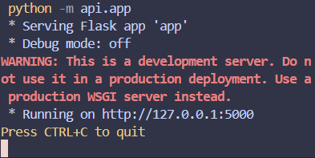

# Botcity Orientado a Objetos - Veículos

Este projeto utiliza o conceito de orientação a objetos em _Python_ e uma _API_ _Flask_
que manipula um banco de dados _MySQL_ para gerenciar um sistema de aluguel de veículos
(carros e motocicletas). São utilizadas diferentes rotas em cada template para instanciar
um objeto das classes Carro ou Motocicleta ao utilizar o _submit_ do formulário _HTML_.

## Início

Estas instruções detalham o fluxo que deve ser seguido para poder executar esta automação.

### Pré-requisitos
- Ter o ***Python*** instalado na máquina
- Ter o ***XAMPP*** instalado para levantar o banco de dados
- Ter o ***Visual Studio Code*** instalado para gerenciamento de extensões e execução do projeto
- Extensão ***MySQL*** (Jun Han) instalada no _VS Code_

### Execução
#### Banco de Dados ***MySQL***

* Primeiramente, deve-se abrir o _XAMPP_ e levantar um banco de dados _MySQL_, na porta **3306**. A aplicação deve estar assim:

    

* Em seguida, realizar a conexão do _MySQL_ no _VS Code_: Clicar no ícone de **+** na aba _MySQL_ dentro do painel lateral _Explorer_. 

    

* Isso irá abrir um _prompt_ na parte superior do _VS Code_ que irá solicitar os dados referentes ao banco. Informe as seguintes entradas:
  - ___host___: _localhost_
  - ___user___: _root_
  - ___password___: (Vazia, apenas dê um _enter_)
  - ___port___: 3306
  - ___certificate file path___: (Vazia, apenas dê um _enter_)

* Após isso, a conexão estará feita no _VS Code_ e podemos seguir para os próximos passos.

    

* Executar o _Script_ ***SQL*** dentro da pasta _resources_ para criar o banco de dados **Veículos**.


#### _API_ ***Flask***

* Criar um ambiente virtual para instalar as dependências:
  ```
  python -m venv venv
  venv/Scripts/Activate
  
  (venv) pip install -r requirements.txt
  ```

* Neste terminal, execute a _API_ com o seguinte comando:
  ```
  python -m api.app
  ```

* Em poucos segundos, o _Flask_ sinalizará que a _API_ está rodando, e poderá ser acessada
  através do _endpoint_ que aparecerá no terminal. Você pode acessar e testar as rotas e 
  funcionalidades antes de seguir para a automação:

    


#### Automação ***BotCity***

* Abrir um novo terminal e executar o seguinte comando (certifique-se de estar dentro 
  do ambiente com as dependências instaladas (`venv/Scripts/Activate`)):
  ```
  (venv) python -m automation.bot
  ```

* Em alguns segundos a automação estará rodando e irá solicitar dois _inputs_, sendo 
  eles a quantidade de vezes que o _bot_ irá acessar cada formulário.

* Observe o _bot_ fazer seu trabalho : )

## Explicação

Esse projeto baseia-se nas três classes básicas declaradas dentro do diretório _classes_: **Veículo**,
**Carro** e **Motocicleta**. Cada uma dela tem **regras de negócio** específicas e atributos diferentes,
e há uma relação de **herança** entre Veiculo como superclasse e as outras como subclasses.

Baseado nessas classes, foram modeladas tabelas no banco de dados através do módulo _SQLAlchemy_ para
a **persistência** dos dados e melhor **manipulação dos dados**. Assim como nas classes em _Python_, 
também foi modelado um relacionamento entre a tabela de Veículo e suas filhas.

A _API_ providencia _templates_ _HTML_ (em conjunto com arquivos estáticos _CSS_ e _JavaScript_) para
que se tenha uma **interface de usuário** disponível para que seja possível realizar as operações de 
_CRUD_ (_Create_, _Reade_, _Update_, _Delete_) nestes objetos veículos. A interface disponibiliza 
serviços _Flask_ e funcionalidades _JavaScript_ para manipulação dos dados e atualizações no banco .

Por fim, a automação utiliza do BotCity e seus submódulos para utilizar dessa API para criar algumas
instâncias (número providenciado pelo usuário) de Carros e Motocicletas.